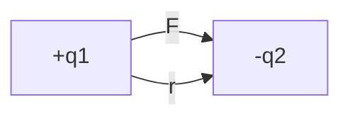
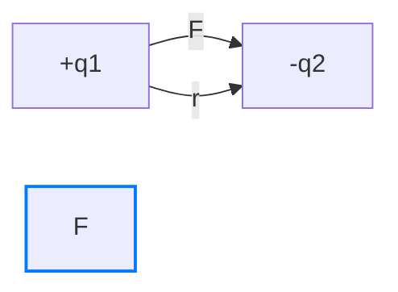

# Coulomb's Law: Unlocking the Secrets of Electric Forces
===========================================================

Hey there, future physicist! Ever wondered how your phone sticks to its charger or why static electricity shocks you sometimes? It all comes down to electric forces, and Coulomb's Law is the key to understanding them. Let's dive in and explore the fascinating world of electric forces!

## What is Coulomb's Law?
------------------------

Coulomb's Law is a fundamental principle in physics that describes the electrostatic force between two charged objects. Imagine two magnets, but instead of magnetic forces, we're dealing with electric charges that can either attract or repel each other.

**The Basics:**
* The more charge you have, the stronger the force.
* The closer the charges are, the stronger the force.

**The Fancy Definition:**
------------------------

The electrostatic force between two point charges is:
* Directly proportional to the product of the magnitudes of each charge.
* Inversely proportional to the square of the distance between them.

### Visualizing Charge Interactions

To better understand how charges interact, let's consider a simple diagram:



In this example, we have two charges, `+q1` and `-q2`, separated by a distance `r`. The force `F` between them is attractive, as opposite charges attract.

## Breaking it Down
------------------

Let's unpack the formula:

``` 
F = k * (|q1 * q2|) / r^2
```

Where:

* `F` is the electrostatic force (what we're trying to find).
* `k` is Coulomb's constant (approximately 8.99 x 10^9 N·m²/C²).
* `q1` and `q2` are the magnitudes of the charges (measured in Coulombs).
* `r` is the distance between the centers of the charges.

**Key Ideas:**
* **Charge Matters:** Bigger charges mean bigger forces. If you double one of the charges, you double the force!
* **Distance is Key:** The closer the charges, the much bigger the force. If you halve the distance, you quadruple the force!
* **Attractive vs. Repulsive:** Like charges repel (positive-positive or negative-negative), and opposite charges attract (positive-negative).

## The Vector Nature of Force
---------------------------

But here's the thing: force is a vector quantity, which means it has both magnitude and direction. To calculate the force between two charges, we need to consider the direction of the force.

**Unit Vectors:**
-----------------

We can use unit vectors to represent the direction of the force. A unit vector is a vector with a magnitude of 1 and a direction that points from one charge to the other.

``` 
F = k * (|q1 * q2|) / r^2 * \\hat{r}
```

Where `\\hat{r}` is the unit vector pointing from `q1` to `q2`.

## Visualizing Vector Forces
---------------------------

Imagine two charges, `+q1` and `-q2`, separated by a distance `r`. We can draw the force vector `F` as an arrow pointing from `q1` to `q2`. The direction of the force is attractive, as opposite charges attract.



## Superposition Principle
-------------------------

What if we have multiple charges? The superposition principle states that the total force on a charge is the sum of the forces due to each individual charge.

**Example:**
-------------

Suppose we have three charges: `+q1`, `-q2`, and `+q3`. The total force on `q1` is the sum of the forces due to `-q2` and `+q3`.

## Coulomb's Law in Comparison to Gravitational Force
------------------------------------------------

Coulomb's Law is often compared to the law of universal gravitation. Both laws describe a force that decreases with the square of the distance between objects. However, there are some key differences:

* **Force Type:** Gravitational force is always attractive, while electrostatic force can be attractive or repulsive.
* **Force Strength:** Gravitational force is much weaker than electrostatic force.

## Real-World Applications
-------------------------

Coulomb's Law has numerous applications in our daily lives. For example:

* **Lightning Rods:** These devices protect buildings from lightning strikes by attracting the electrical charge and directing it harmlessly into the ground.
* **Air Purifiers:** Some air purifiers use electrostatic charges to attract and trap dust particles, improving indoor air quality.
* **Semiconductor Devices:** Coulomb's Law is crucial for designing semiconductor devices, such as transistors and diodes.

## Continuous Charge Distributions
---------------------------------

So far, we've only considered point charges. But what about continuous charge distributions? In this case, we need to integrate the charge distribution to find the total force.

**Example:**
-------------

Suppose we have a uniformly charged rod. We can use Coulomb's Law to find the force on a test charge near the rod.

### Integrating Charge Distributions

To integrate the charge distribution, we need to divide the rod into small charge elements and calculate the force due to each element. We can then sum up the forces to find the total force.

``` 
F = ∫k * (|dq * q|) / r^2
```

Where `dq` is the charge element and `r` is the distance between the charge element and the test charge.

## Example Time!
----------------

Let's say you have two charges: +2 μC and -3 μC, separated by a distance of 2 meters. What's the force between them?

``` 
F = k * (|q1 * q2|) / r^2
F = (8.99 x 10^9 N·m²/C²) * (|2 μC * -3 μC|) / (2 m)^2
F = (8.99 x 10^9 N·m²/C²) * (6 x 10^-12 C²) / (4 m²)
F = 13.5 N
```

The force is 13.5 N. Since the charges have opposite signs, the force is attractive.

### Checking Your Understanding

What would happen to the force if you doubled the distance between the charges? 

*Hint: Recall that the force decreases with the square of the distance.*

How would the force change if you tripled one of the charges?

*Hint: Recall that the force is directly proportional to the product of the charges.*

## Solutions to Understanding Checks

* If you double the distance between the charges, the force will decrease to 1/4 of its original value (since F ∝ 1/r²).
* If you triple one of the charges, the force will increase to 3 times its original value (since F ∝ q1 * q2).

## Limitations of Coulomb's Law
-----------------------------

While Coulomb's Law is a powerful tool, it has its limitations. For example:

* **Point Charge Assumption:** Coulomb's Law assumes that the charges are point-like, meaning they have no size or shape. In reality, charges can have complex distributions, affecting the force between them.

## Wrapping Up
--------------

Coulomb's Law is a fundamental law of physics that describes the electrostatic interaction between charged objects. Understanding it gives you insights into how the world works, from the smallest atoms to the largest electrical systems. Keep exploring, and you'll uncover even more cool applications of this powerful law!

What's the next step in your learning journey? How can you apply Coulomb's Law to real-world problems or explore its connections to other areas of physics?